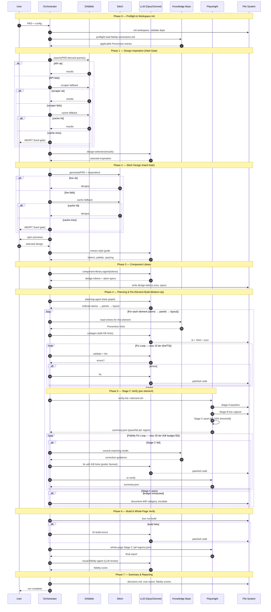

# Agentic Flow — Swimlane Diagram

End-to-end flow of the Angular UI generator agent. Rendered as a Mermaid sequence diagram (swimlane-equivalent: each participant is a lane, arrows are handoffs).

## Lanes

| Lane | Role |
|------|------|
| **User** | Supplies PRD, selects Stitch design |
| **Orchestrator** | `src/orchestrator/pipeline.mts` — coordinates all phases |
| **Dribbble** | Design inspiration source (API → scraper → cache) |
| **Stitch** | Google Stitch design generator (live → cache) |
| **LLM** | Claude — Opus (planning/design) + Sonnet (codegen/fixes) |
| **KB** | Knowledge base — `docs/knowledge-bases/*` fidelity corrections |
| **Playwright** | `scripts/verify.mts` — Stage A/B/C pixel-diff validator |
| **FS** | File system — generated Angular workspace + reports |

## Diagram

## Decision & Loop Points

| # | Point | Branch | Cap |
|---|-------|--------|-----|
| 1 | Dribbble source | API → scraper → cache → **abort** | 3 strategies, hard gate |
| 2 | Stitch generation | live → cache → **abort** | 2 strategies, hard gate |
| 3 | Fix Loop (lint/TS) | errors → LLM fix → re-lint | **10 iter/task** |
| 4 | Fidelity Fix Loop (Stage C) | pixel miss > 10% → KB → LLM fix → re-verify | **30 iter/element** (KB §5) |
| 5 | Budget exhausted | categorize drift, document, move on | hard stop |
| 6 | Build failure | LLM fixes, retry compile | implicit fix-loop |

## Key File Pointers

- `src/index.mts:64` — entry point, CLI + login
- `src/orchestrator/pipeline.mts:104` — 6-phase orchestrator
- `src/orchestrator/fix-loop.mts:41` — 10-iter lint/TS loop
- `scripts/verify.mts:43` — Stage A/B/C Playwright validator (10% threshold at line 16)
- `docs/ui-plan/04-per-element-workflow.md:66` — universal per-element workflow
- `docs/prompts/codegen.md:1` — mandatory KB preflight for codegen
- `docs/prompts/visual-fidelity.md:1` — visual reviewer prompt
- `docs/knowledge-bases/panel-model-fidelity-corrections.md:1` — KB source
